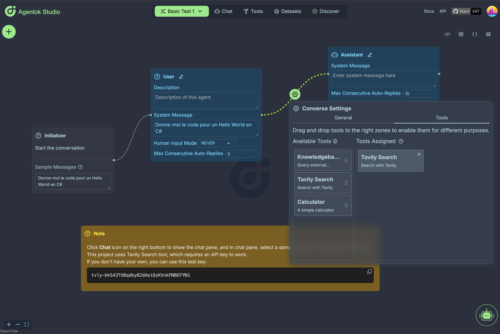
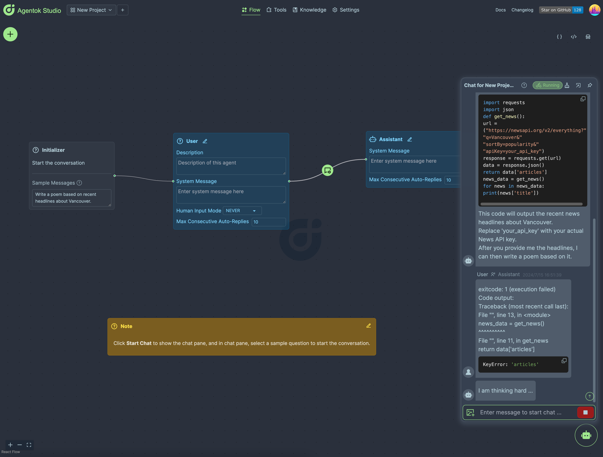

> [!Warning]
> We're actively developing the next version on branch `dev`. The `main` branch will be frozen until the next major release.


# Agentok Studio

**AG2 Visualized - Build Agentic Apps with Drag-and-Drop Simplicity.**

[](https://vscode.dev/redirect?url=vscode://ms-vscode-remote.remote-containers/cloneInVolume?url=https://github.com/dustland/agentok)
[](https://codespaces.new/dustland/agentok)
[](https://opensource.org/licenses/Apache-2.0)

[](https://star-history.com/#dustland/agentok)
[](https://discord.gg/xBQxwRSWfm)

## 🌟 What is Agentok Studio

Agentok Studio is a tool built upon [AG2](https://github.com/ag2ai/ag2)(Previously AutoGen), a powerful agent framework from Microsoft and [a vibrant community of contributors](https://github.com/ag2ai/ag2?tab=readme-ov-file#contributors-wall).

### Visualizing AG2

We consider AG2 to be at the forefront of next-generation Multi-Agent Applications technology. Agentok Studio takes this concept to the next level by offering intuitive visual tools that streamline the creation and management of complex agent-based workflows. This simplifies the entire process for creators and developers.


### Conversation Relations

The relationship between two agents is essential. To incorporate tool calls in a conversation, the LLM must determine which tools to invoke, while informing the user proxy about which nodes to execute. Configuring tools on the edge between these nodes is crucial for optimal operation.



### Code Generation

We strive to create a user-friendly tool that generates native Python code with minimal dependencies. Simply put, Agentok Studio is a diagram-based code generator for ag2. The generated code is self-contained and can be executed anywhere as a normal Python program, relying solely on the official `ag2` library.


Contributions (Issues, Pull Requests, Documentation, even Typo-corrections) to this project are welcome! All contributors will be added to the Contribution Wall.

> [!Note]
> RAG feature has been removed from this project, since we believe it should be a separate service.

## 💡 Quickstart

To quickly explore the features of Agentok Studio, visit [https://studio.agentok.ai](https://studio.agentok.ai). While we offer an online deployment of this project, please note that it is not intended for production use. The service level agreement is not guaranteed, and stored data may be wiped due to breaking changes.

After login as Guest or with your OAuth2 account, you can click the **Create New Project** button to create a new project. The new project comes with a sample workflow. You can click the robot icon flashing on the right bottom to start the conversation.



Due to the limitations of GPT-4 and AG2, this simple workflow may not work as expected, but it's a good starting point to understand the basic concepts of Agentic App and Agentok Studio.

For a more in-depth look at the project, please refer to [Getting Started](https://agentok.ai/getting-started).

## 🐳 Run on Local (with Docker)

The project contains Frontend (Built with Next.js) and Backend service (Built with FastAPI in Python), and have been fully dockerized.

Before running the project, you need to create a `.env` file in the `ui` abd `api` directory and set environment variables.

```bash
cp frontend/.env.sample frontend/.env
cp api/.env.sample api/.env
cp api/OAI_CONFIG_LIST.sample api/OAI_CONFIG_LIST
```

Please be aware that Supabase provides both **anon** key and **service_role** key for each project. Please be sure to set anon key to `NEXT_PUBLIC_SUPABASE_ANON_KEY` for frontend, and service role key to `SUPABASE_SERVICE_KEY` for backend(api).

The easiest way to run on local is using docker-compose:

```bash
docker-compose up -d
```

You can also build and run the ui and service separately with docker:

```bash
docker build -t agentok-api ./api
docker run -d -p 5004:5004 agentok-api

docker build -t agentok-frontend ./frontend
docker run -d -p 2855:2855 agentok-frontend

```

(The default port number 2855 is the address of our first office.)

## 🛠️ Run on Local (Without Docker)

If you're interested in contributing to the development of this project or wish to run it from the source code, you have the option to run the ui and service independently. Here's how you can do that:

### **Frontend**

- Navigate to the frontend directory `cd frontend`.
- Rename `.env.sample` to `.env.local` and set the value of variables correctly.
- Install the necessary dependencies using the appropriate package manager command (e.g., `pnpm install` or `yarn`).
- Run the frontend service using the start-up script provided (e.g., `pnpm dev` or `yarn dev`).

> If you see Server Error related to 'useContext' quite often, it's possibly caused by the bugs in turbo mode. In this case, please remove `--turbo` from the **dev** command in package.json.

### **Backend Services**

- Switch to the api service directory `cd api`.
- Rename `.env.sample` to `.env`, `OAI_CONFIG_LIST.sample` to `OAI_CONFIG_LIST`, and set the value of variables correctly.
- Install Poetry.
- Launch with command `poetry run uvicorn agentok_api.main:app --reload --port 5004`.

`REPLICATE_API_TOKEN` is needed for LLaVa agent. If you need to use this agent, make sure to include this token in environment variables.

**IMPORTANT**: The latest version of AG2 requires Docker for code execution by default. To proceed, you must either:

1. Install Docker on your local machine, **OR**
1. Disable this requirement by setting `AUTOGEN_USE_DOCKER=False` in the `api/.env` file.

Note: This requirement is disabled by default since the default deployment of this project is already dockerized.

### **Database Services**

This project relies on Supabase for user authentication and data storage. To get started, please follow the [./db/README.md](./db/README.md) to prepare the database, and set the environment variables (Refer to those variables with name starts with SUPABSE in .env.sample) in the `.env` file.

If you prefer, you can deploy your own Supabase instance, but that is beyond the scope of this document.

Once you've started both the frontend and api services by following the steps previously outlined, you can access the application by opening your web browser and navigating to:

- api: http://localhost:5004 (OpenAPI docs served at http://localhost:5004/docs)
- frontend: http://localhost:2855

If your services are started successfully and running on the expected ports, you should see the user interface or receive responses from the api services via this URL.

## 👨‍💻 Contributing

[](https://discord.gg/xBQxwRSWfm)

Contributions are welcome! It's not limited to code, but also includes documentation and other aspects of the project. You can open a [GitHub Issue](https://github.com/hughlv/agentok/issues/new) or leave comments on our [Discord Server](https://discord.gg/xBQxwRSWfm).

This project welcomes contributions and suggestions. Please read our [Contributing Guide](./CONTRIBUTING.md) first.

If you are new to GitHub, [here](https://help.github.com/categories/collaborating-with-issues-and-pull-requests/) is a detailed help source on getting involved with development on GitHub.

Please consider contributing to [AG2](https://github.com/ag2ai/ag2), as Agentok Studio relies on a robust foundation to deliver its capabilities. Your contributions can help enhance the platform's core functionalities, ensuring a more seamless and efficient development experience for Multi-Agent Applications.

This project uses [📦🚀semantic-release](https://github.com/semantic-release/semantic-release) to manage versioning and releases. To avoid too frequent auto-releases, we make it a manual GitHub Action to trigger the release.

To follow the Semantic Release process, we enforced commit-lint convention on commit messages. Please refer to [Commitlint](https://commitlint.js.org/#/) for more details.

## Contributors Wall

<a href="https://github.com/hughlv/agentok/graphs/contributors">
  
</a>

## 📝 License

The project is licensed under [Apache 2.0 with additional terms and conditions](./LICENSE.md).
