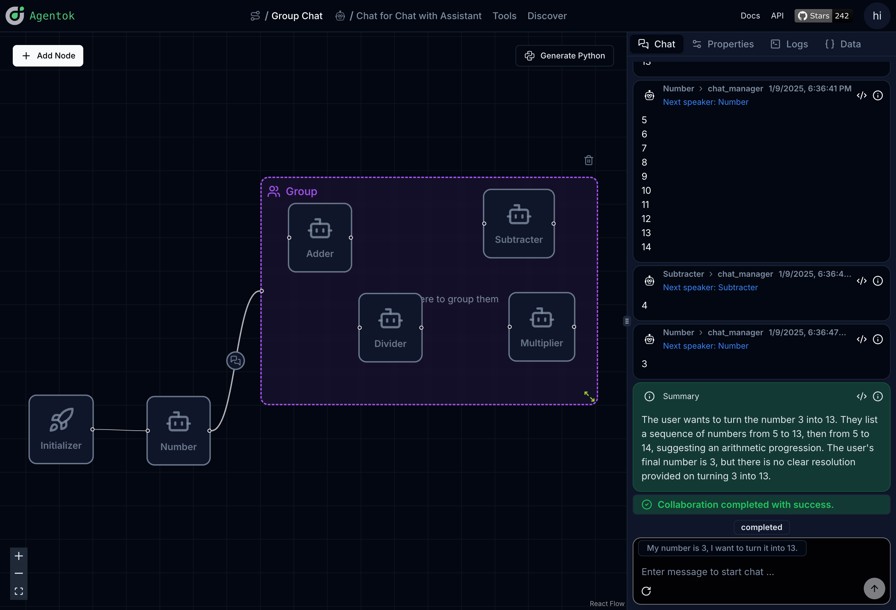
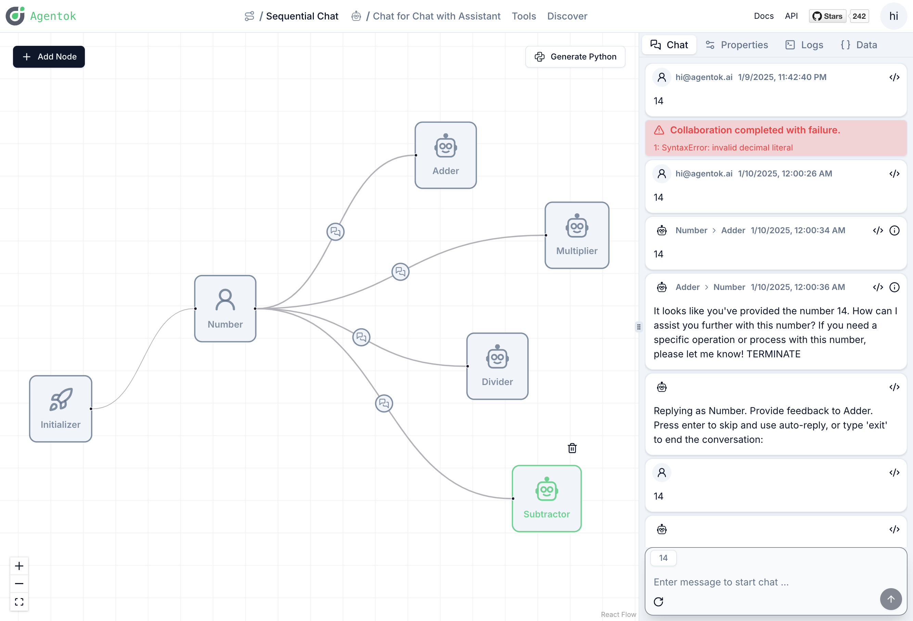
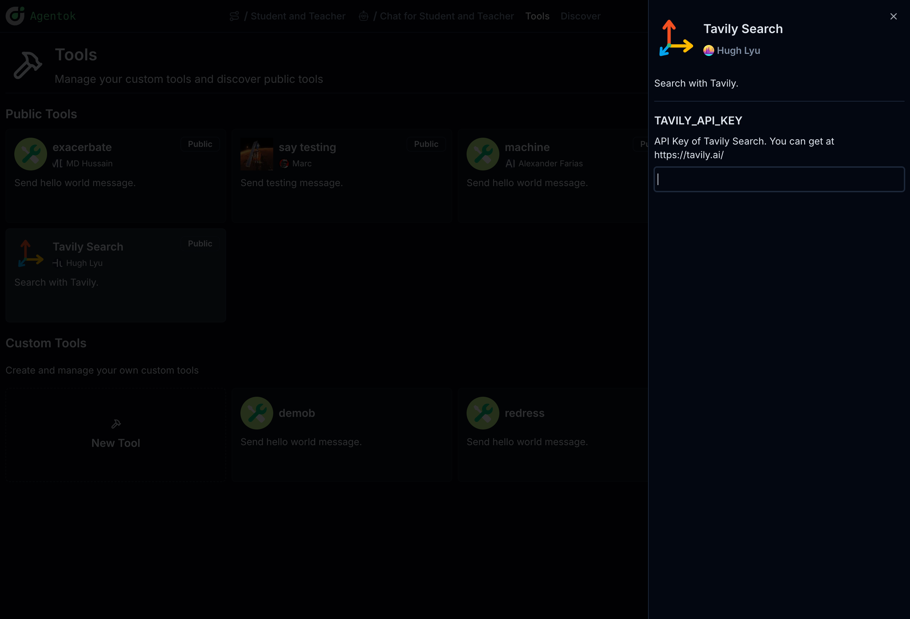
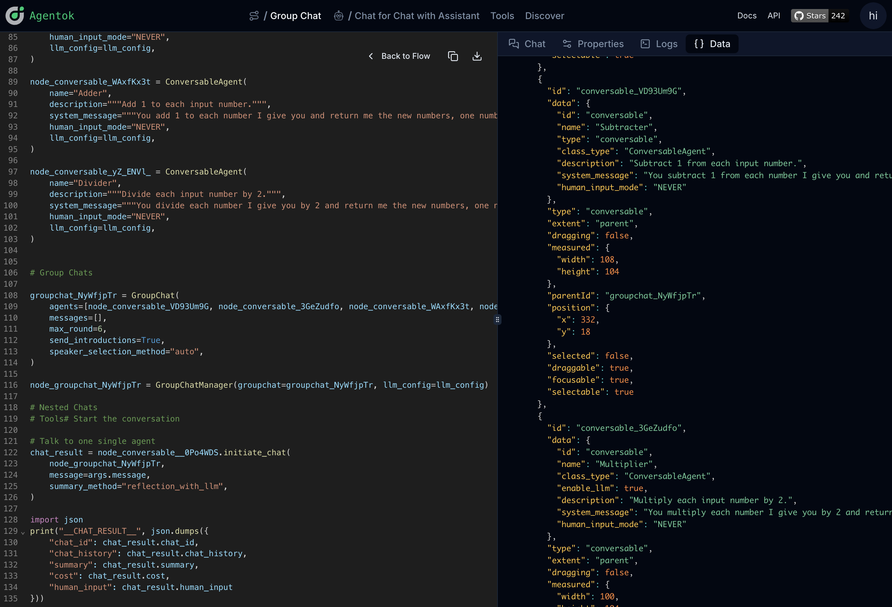
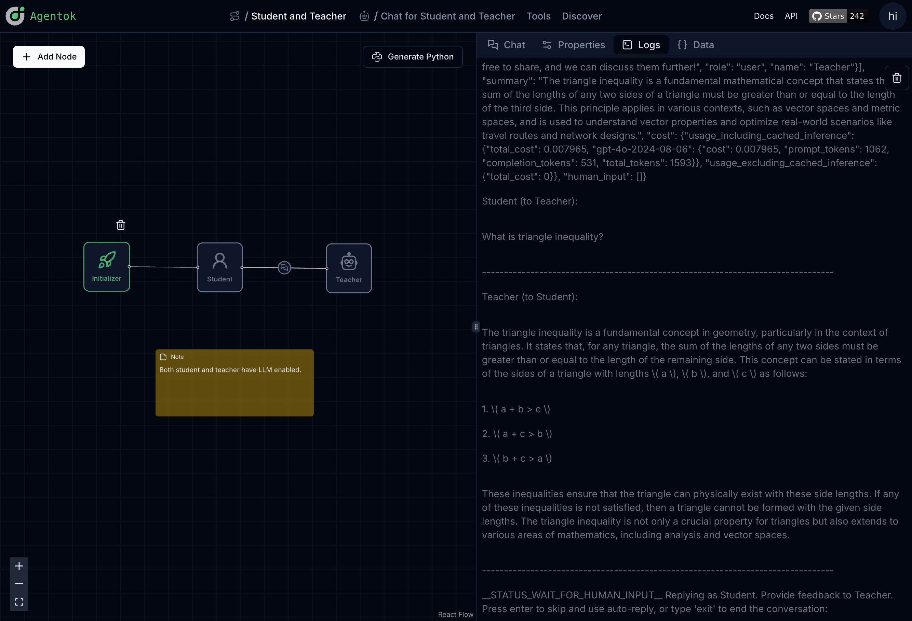

# Agentok Studio

**AG2 Visualized - Build Agentic Apps with Drag-and-Drop Simplicity.**

[](https://vscode.dev/redirect?url=vscode://ms-vscode-remote.remote-containers/cloneInVolume?url=https://github.com/dustland/agentok)
[](https://codespaces.new/dustland/agentok)
[](https://opensource.org/licenses/Apache-2.0)

[](https://star-history.com/#dustland/agentok)
[](https://discord.gg/xBQxwRSWfm)

## 🌟 What is Agentok Studio

Agentok Studio is a tool built upon [AG2](https://github.com/ag2ai/ag2) (Previously AutoGen), a powerful agent framework from Microsoft and [a vibrant community of contributors](https://github.com/ag2ai/ag2?tab=readme-ov-file#contributors-wall).

### Visualizing AG2

We consider AG2 to be at the forefront of next-generation Multi-Agent Applications technology. Agentok Studio takes this concept to the next level by offering intuitive visual tools that streamline the creation and management of complex agent-based workflows.



### Conversation Relations

The relationship between two agents is essential. To incorporate tool calls in a conversation, the LLM must determine which tools to invoke, while informing the user proxy about which nodes to execute. Configuring tools on the edge between these nodes is crucial for optimal operation.



You can switch between light and dark themes using the toggle in the top right corner.

For more information related to Conversation Patterns, please refer to [Conversation Patterns](https://docs.ag2.ai/docs/tutorial/conversation-patterns).

### Tools

We provide a tool editor to help you create and manage tools.


The tool can contain variables, which users can configure in the tool management page.



### Full Visibility of Code and Data

We strive to create a user-friendly tool that generates native Python code with minimal dependencies. Simply put, Agentok Studio is a diagram-based code generator for AG2. The generated code is self-contained and can be executed anywhere as a normal Python program, relying solely on the official `ag2` library.



As shown above, we provide full visibility into the underlying data representation of the flow for diagnosis and debugging.

We also attached the original logs(stdout and stderr) from AG2 execution, so you can fully understand the underlying execution process:



> [!Note]
> RAG feature has been removed from this project, as we believe it should be a separate service.

## 💡 Quickstart

Visit [https://studio.agentok.ai](https://studio.agentok.ai) to quickly explore Agentok Studio's features. While we offer an online deployment, please note that it is not intended for production use. The service level agreement is not guaranteed, and stored data may be wiped due to breaking changes.

After logging in as a Guest or with your OAuth2 account, click **Create New Project** to start a new project. Each new project comes with a sample workflow. Switch to the **Chat** tab to begin the conversation.


For a more in-depth look at the project, please refer to [Getting Started](https://agentok.ai/getting-started).

## 🐳 Run Locally (with Docker)

The project consists of a Frontend (built with Next.js) and Backend service (built with FastAPI in Python), both fully dockerized.

Before running the project, create `.env` files in both the `frontend` and `api` directories:

```bash
cp frontend/.env.sample frontend/.env
cp api/.env.sample api/.env
cp api/OAI_CONFIG_LIST.sample api/OAI_CONFIG_LIST
```

Note: Supabase provides both **anon** and **service_role** keys for each project. Use the anon key for `NEXT_PUBLIC_SUPABASE_ANON_KEY` (frontend) and service role key for `SUPABASE_SERVICE_KEY` (backend).

The easiest way to run locally is using docker-compose:

```bash
docker-compose up -d
```

You can also build and run the UI and service separately with Docker:

```bash
docker build -t agentok-api ./api
docker run -d -p 5004:5004 agentok-api

docker build -t agentok-frontend ./frontend
docker run -d -p 2855:2855 agentok-frontend
```

(Port 2855 represents our first office address.)

## 🛠️ Run Locally (Without Docker)

For development or running from source:

### Frontend

1. Navigate to the frontend directory: `cd frontend`
2. Rename `.env.sample` to `.env.local` and configure variables
3. Install dependencies: `pnpm install` or `yarn`
4. Start the development server: `pnpm dev` or `yarn dev`

> Note: If you encounter frequent Server Errors related to 'useContext', try removing `--turbo` from the **dev** command in package.json.

### Backend Services

1. Navigate to the api directory: `cd api`
2. Rename `.env.sample` to `.env` and `OAI_CONFIG_LIST.sample` to `OAI_CONFIG_LIST`
3. Install Poetry
4. Start the service: `poetry run uvicorn agentok_api.main:app --reload --port 5004`

`REPLICATE_API_TOKEN` is required for LLaVa agent functionality.

**IMPORTANT**: AG2's latest version requires Docker for code execution by default. Either:

1. Install Docker locally, OR
2. Set `AUTOGEN_USE_DOCKER=False` in `api/.env`

Note: Docker requirement is disabled by default in our dockerized deployment.

### Database Services

This project uses Supabase for authentication and data storage. Follow [./db/README.md](./db/README.md) to prepare the database and set environment variables (SUPABASE\_\* in .env.sample).

Once services are running, access:

- API: http://localhost:5004 (OpenAPI docs: http://localhost:5004/docs)
- Frontend: http://localhost:2855

## 👨‍💻 Contributing

[](https://discord.gg/xBQxwRSWfm)

We welcome all contributions! This includes code, documentation, and other project aspects. Open a [GitHub Issue](https://github.com/hughlv/agentok/issues/new) or join our [Discord Server](https://discord.gg/xBQxwRSWfm).

Please read our [Contributing Guide](./CONTRIBUTING.md) before getting started.

New to GitHub? Check out their [guide on collaborating with issues and pull requests](https://help.github.com/categories/collaborating-with-issues-and-pull-requests/).

Consider contributing to [AG2](https://github.com/ag2ai/ag2) as well, since Agentok Studio builds upon its capabilities.

This project uses [📦🚀semantic-release](https://github.com/semantic-release/semantic-release) for versioning and releases. Releases are triggered manually via GitHub Actions to avoid excessive automation.

We enforce [Commitlint](https://commitlint.js.org/#/) conventions for commit messages.

## Contributors Wall

<a href="https://github.com/hughlv/agentok/graphs/contributors">
  
</a>

## 📝 License

This project is licensed under the [Apache 2.0 License with additional terms and conditions](./LICENSE.md).
