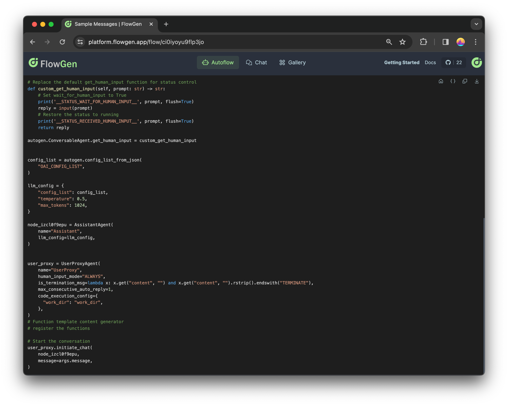

# Getting Started

## What is Agentok Studio

Agentok Studio is a tool built for [AutoGen](https://microsoft.github.io/autogen/), a fantastic agent framework from Microsoft Research.

AutoGen streamlines the process of creating multi-agent applications with its clear and user-friendly approach. Agentok Studio takes this accessibility a step further by offering visual tools that simplify the building and management of agent workflows.

## Key Concepts

### Agent

The **Agent** is the core concept in AutoGen and Agentok Studio. For applications, this usually means a **ConversableAgent**, which includes two types: **AssistantAgent** and **UserProxyAgent**.

- **Assistant Agent**

  The **AssistantAgent** is your go-to helper to accomplish a task—it could be a chatbot, a code generator, or a planner—perhaps even a blend of them.

- **UserProxy Agent**

  The **UserProxyAgent** enables interaction with the **AssistantAgent**. It can take the form of a chatbot, a code executor, or even a human—it's quite the versatile agent.

### Workflow

A **Workflow** consists of a network of **Agents**. It's the foundation of any multi-agent application.

A standard Workflow usually includes one **UserProxyAgent** and one or several **AssistantAgents**. The **UserProxyAgent** is your direct line of interaction, while the **AssistantAgents** work behind the scenes, collaborating to build a robust multi-agent application.

### Chat

Each Chat represents a live session that has been spun up from a Workflow or a AutoflowTemplate.

### Workflow Template

Ready to launch a Workflow? Publish it as a **AutoflowTemplate** in the [Agentok Studio Template](https://studio.agentok.ai/templates/)! Users can then deploy these templates to conjure up new Workflows or strike up chats directly on the template itself.

## "Hello World"

Let's jump straight in and create a simple "Hello World" flow.

### Initialize a New Workflow

Head over to [Agentok Studio Login](https://studio.agentok.ai/auth/login) and tap **Login as Guest** for a test run without the need to sign up.

It's always a good practice to login with your own social ID and create your own Workflow to play with.

:::warning

Guest mode means your data is an open book to other guests. Sign in with your GitHub/Google/X account for a private experience.

:::

Once you're in, go to the [homepage](https://studio.agentok.ai) and hit the **Build from Scratch** button to weave a new Workflow.

### Build Your First Workflow

Get started by tidying up the canvas—scrap any sample nodes that are hanging about. Now, let's get crafting:

1. Tap the plus sign ⨁ in the top left and ferry over an **Assistant Agent**.
2. Next, snag a **UserProxy Agent** and drop it in place.
3. Connect these two, and voilà—you've got flow! 🔗

Here’s a visual to guide you through:

Some key points to note:

- Set **Human Input Mode** to **ALWAYS**, so human (you) can always provide feedback.
- Set **Max Consecutive Auto-Replies** to **1**, so that if AsssitantAgent provide some code to execute, you can simply press Enter and UserProxyAgent will help to execute the code and send back the result to AssitantAgent. This is exactly what means by **Multi-Agent Collaboration**.
- A few **Sample Messages** are provided in Config node. This is a convenient feature for your target users to get started with your Workflow.

### Start Chat

Fire up your flow by smashing the **Start Chat** button at the top right. Click one sample message above the Send button and watch the magic unfold in your chat window:

We know it's kinda difficult to write the first messages other than 'hi' or 'hello' in a chatbot. As you can see the samples above Send button, So we also provide a **Sample Message** feature to help you and your users get started. You can pick one to click and send.

:::tip

Though the user experience looks like a chat app, we need to clarify that multi-agent app is generally for you to solve complicated problems, so it will not get responded as fast as a chat app. You may need to wait for a few seconds or even minutes to get the final answer.

:::

### Check Python Code

For developers who need to dive into more details about what is happening underhood, you can click the Python icon and check the generated Python code:

In most cases, the generated code has few dependencies other than AutoGen. You can copy and download the code to your local machine and run as norml console program with Python.

### Publish as Template

If you're happy with your flow, publish it as a template for others to use. On [Workflow](https://studio.agentok.ai/flows) page you can find your Workflow to publish:

hit the **Publish as Template** button at the bottom right of the Workflow card:

And then you can find your template on [Template](https://studio.agentok.ai/templates) page:

By clicking on the template card, you can view the details of the template:

The URL of template page is static and public, so you can share it with others to start a chat directly. You can also click the **Fork** button to build your own Workflow based on this template.

## Next Steps

This tutorial provided a concise overview, analogous to an introductory ChatGPT session. The dialog exchange was streamlined – a single interaction cycle swiftly delivers the intended message, concluding the UserProxyAgent demonstration effectively.

Looking ahead, we plan to enhance the functionality, introducing additional features to enrich the user experience. Stay tuned for further developments!

## More Readings

Got a taste for Agentok Studio? Feast on these resources for seconds:

- [Agentok Studio Template](https://studio.agentok.ai/templates/): Feast your eyes on a buffet of ready-to-serve templates.
- [Agentok Studio Documentation](https://docs.agentok.ai/): The ultimate guide to becoming a Agentok Studio whiz.
- [Agentok Studio GitHub](https://github.com/hughlv/agentok): Peek under the hood at the source code.
- [AutoGen Documentation](https://microsoft.github.io/autogen/): Master the art of AutoGen with this comprehensive tutorial.
- [AutoGen Notebook](https://github.com/microsoft/autogen/tree/main/notebook): Dive into Jupyter notebooks showcasing AutoGen's prowess.
