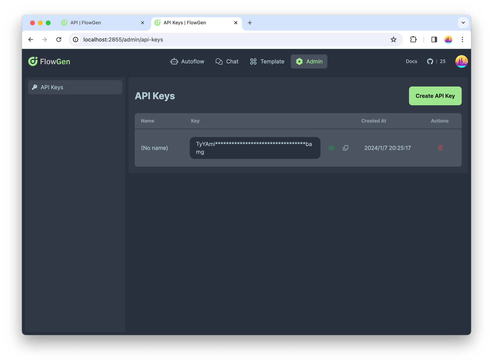

# API

FlowGen provides a set of APIs to manage your chatbots and conversations. By using these APIs, you can integrate FlowGen service into your own applications.

Here we introduce how to use FlowGen service via API.

## API Suite

Access the suite of FlowGen APIs as follows:

- **GET /chats**: Retrieve a list of current chat sessions.
- **GET /chats/\{chat_id\}**: Fetch the status of a specific chat session.
- **POST /chats**: Initiate a new chat session.
- **DELETE /chats/\{chat_id\}**: Remove a specified chat session.
- **POST /chats/\{chat_id\}/messages**: Commence communication by transmitting a message to a chat session.
- **GET /chats/\{chat_id\}/messages**: Retrieve the message history from a chat session.
- **POST /chats/\{chat_id\}/input**: Convey a message to a chat session awaiting human input.

These APIs are available through the `<flowgen-api-domain>/` endpoint. For instance, if utilizing FlowGen's online services, your endpoint would be `https://api.flowgen.app/`.

Refer to the [API Reference](/api-docs) for detailed specifications.

:::warning

The API endpoints outlined in this document are currently in a provisional state and may undergo changes.

We welcome any feedback or issues you encounter via our [**GitHub Issue Tracker**](https://github.com/tiwater/flowgen/issues). Your contributions help us improve..

:::

## Authentication Protocols

FlowGen's APIs support authentication via OAuth2 Bearer Tokens and API Keys. For third-party application integrations, the provision of an API Key in the request header (X-API-KEY) is the recommended authentication method.

Below are examples of how to apply the API Key within various platforms:

import Tabs from '@theme/Tabs';
import TabItem from '@theme/TabItem';

<Tabs>
  <TabItem value="bash" label="Bash" default>

```bash
curl --request GET \
    --url 'https://api.flowgen.app/chats' \
    --header 'X-API-KEY: <api-key>'
```

  </TabItem>
  <TabItem value="typescript" label="TypeScript">

```ts
const res = await fetch(`${NEXT_PUBLIC_BACKEND_URL}/chats`, {
  headers: {
    'Content-Type': 'application/json',
    'X-API-KEY': `${token}`,
  },
});
const chat = await res.json();
```

  </TabItem>
  <TabItem value="python" label="Python">

```py
response = self.client.get(
    f'{self.base_url}/chats',
    headers={"X-API-KEY": api_key},
)
response.raise_for_status()
get_result = response.json()
```

  </TabItem>
</Tabs>

For additional information, please consult the [API Reference](https://api.flowgen.app/api-docs).

## Managing API Keys

To authenticate API requests, API Keys are mandatory. Create and oversee your API Keys through the [FlowGen Platform](https://platform.flowgen.app/admin/api-keys).

[](https://platform.flowgen.app/admin/api-keys)

API Keys can be uniquely generated for distinct operational environments, such as separate keys for development and production. They can be invalidated at any moment through deletion on the management interface.

## Implementation Example: Crafting a Chatbot

Leverage the diverse capabilities of FlowGen's API suite to create a functional chatbot:

### Step 1: Chatbot Creation

First, create a chatbot by calling `POST /chats` API.

```bash
curl --request POST \
     --url 'https://api.flowgen.app/chats' \
     --header 'X-API-KEY: <api-key>'
     --header 'Content-Type: application/json' \
     --data-raw '{ \
         "name": "My Chatbot", \
         "from_type": "flow", \
         "from_flow": "flow_id", \
     }'
```

### Step 2: Communication Initiation

Transmit a message to your chatbot utilizing the `POST /v1/chats/{chat_id}/messages` API:

```bash
curl --request POST \
     --url 'https://api.flowgen.app/chats/{chat_id}/messages' \
     --header 'X-API-KEY: <api-key>' \
     --header 'Content-Type: application/json' \
      --data-raw '{
          "message": "Hello, FlowGen!"
      }'
```

### Step 3: Monitoring Chatbot Status

Given the potential delays introduced by multi-agent collaboration, verify your chatbot's state with a GET request using /chats/\{chat_id\}:

```bash
curl --request GET \
     --url 'https://api.flowgen.app/chats/{chat_id}' \
     --header 'X-API-KEY: <api-key>'
```

The status might exhibit one of the following values:

- `ready`: The chatbot is ready to run
- `running`: The chatbot is running
- `wait_for_human_input`: The chatbot is waiting for human input
- `completed`: The chatbot has finished. It has not big difference with `ready` status. You can still send message to the chatbot to start a new conversation.
- `error`: The chatbot has encountered an error

### Step 4: Retrieving Messages

Extract the communication archive via GET /chats/\{chat_id\}/messages:

```bash
curl --request GET \
     --url 'https://api.flowgen.app/chats/{chat_id}/messages' \
     --header 'X-API-KEY: <api-key>'
     --header 'Content-Type: application/json' \
```

:::info

Utilizing WebSocket technology offers a superior approach for message retrieval, effectively eliminating the inefficiencies of busy waiting that accompany traditional HTTP requests.

We are actively developing this feature to enhance communication capabilities within our service.

:::

### Step 5: Interjecting in Awaiting Conversations

If the chatbot is waiting for human input, you can send a message to the chatbot by calling `POST /chats/{chat_id}/input` API.

```bash
curl --request POST \
     --url 'https://api.flowgen.app/chats/{chat_id}/input' \
     --header 'X-API-KEY: <api-key>' \
      --header 'Content-Type: application/json' \
        --data-raw '{
            "message": "Hello, FlowGen!"
        }'
```

### Step 6: Concluding the Dialogue

Conclude and remove the chat session through a DELETE on the chats/\{chat_id\} endpoint:

```bash
curl --request DELETE \
     --url 'https://api.flowgen.app/chats/{chat_id}' \
     --header 'X-API-KEY: <api-key>'
```

## Final Thoughts

This primer has elucidated the methodology to utilize the FlowGen service via API. Harness these interfaces to embed FlowGen functionalities within bespoke applications or to enhance your existing digital services.
